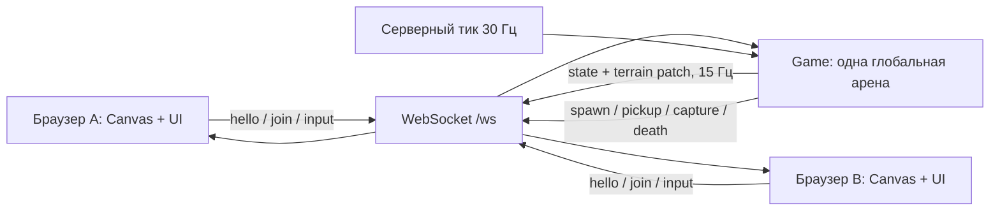

# Paper // Code

Рабочая многопользовательская игра с механикой Paper.io и коллекционированием кодов **876, 156, 367, 986**. Исходный репозиторий `fjfcgghhhhf-bot/ssjsjsjjsjsjssjjs` был пустым, поэтому проект реализован с нуля. Графика, название и интерфейс собственные, без ресурсов Paper.io.

## Быстрый запуск

Нужен Node.js **22 или новее** и npm. В папке проекта:

```sh
npm install
npm start
```

Откройте **http://localhost:3000** в двух вкладках или браузерах, задайте разные имена и нажмите «Играть». Обе вкладки попадут на один сервер и будут видеть друг друга. На компьютере, где установлен только Node.js и уже есть `node_modules`, достаточно `node server.js`.

Tailwind CSS уже скомпилирован в `public/tailwind.css`. Пересобрать после добавления классов:

```sh
npm run build:css
npm test
npm run check
```

Также поддерживается pnpm: `pnpm install`, `pnpm start`. Нативный скрипт необязательного watcher отключён в `pnpm-workspace.yaml`; для однократной сборки CSS он не нужен.

## Структура

```text
papercode/
├── server.js                 HTTP, WebSocket, одно глобальное лобби, сессии
├── src/
│   ├── config.js             размеры, скорость, направления, цвета, коды
│   └── game.js               независимая серверная игровая симуляция
├── public/
│   ├── index.html            меню, игровая арена, лидеры, коллекция, правила
│   ├── app.js                сеть, управление, UI, тосты, переподключение
│   ├── renderer.js           Canvas, камера, интерполяция, миникарта
│   ├── snapshots.js          буфер сетевых снимков и единая шкала анимации
│   ├── style.css             собственный адаптивный визуальный стиль
│   ├── tailwind.css          готовые локальные Tailwind-утилиты
│   └── favicon.svg           собственный знак
├── styles/tailwind.css       источник сборки Tailwind
├── tests/
│   ├── game.test.js          захват, столкновения, коды, инварианты симуляции
│   ├── server.test.js        несколько реальных WebSocket-клиентов и HTTP
│   └── snapshots.test.js     неравномерная сеть, повороты, синхронизация хвоста
├── .env.example              параметры запуска
├── Dockerfile               образ для сервера с доступом из интернета
└── package.json
```

## Архитектура взаимодействия



Сервер хранит клеточную карту **84 × 60**, владельцев клеток, позиции, следы и коллекции. На каждом тике он продвигает квадраты со скоростью 6 клеток/с, рассчитывает столкновения, захват и подбор. Клиент может отправить только направление: координаты, владения и «событие подбора» от клиента не принимаются. Боты проходят ту же симуляцию, что и игроки, и помечены **B** в рейтинге.

Клиент получает позиции и следы 15 раз в секунду. Снимки воспроизводятся с буфером **100 мс**, который сглаживает неравномерное поступление пакетов. Приём нового пакета не перезапускает анимацию. Сервер передаёт время прохождения центров клеток: движение проходит через каждый угол, без диагональных срезов. Голова, непрерывная лента хвоста, камера, миникарта и территория используют одну временную шкалу; будущие клетки хвоста не рисуются впереди головы. При потере пакетов анимация останавливается на последнем подтверждённом состоянии, не придумывая движение. История ограничена 32 снимками, чтобы фоновые вкладки не копили данные бесконечно.

Изменения территории передаются парами `[индекс, владелец]` и применяются по мере воспроизведения соответствующего снимка. При входе, восстановлении и каждые 5 секунд передаётся полная карта. WebSocket сохраняет порядок сообщений. Если клиент не успевает принимать данные, соединение закрывается, затем он получает полное состояние после переподключения. По умолчанию на арене **два бота**, которые соблюдают те же правила, что и игроки.

### Захват и столкновения

1. Выйдя со своей территории, квадрат оставляет незащищённый след.
2. При возвращении сервер временно объединяет базу и след в непроходимую границу.
3. Заливка идёт от всех краёв карты. Недоступные извне клетки составляют замкнутую внутреннюю область. Она и след переходят игроку, включая чужую территорию.
4. Пересечение своего следа или края карты убивает игрока. Пересечение следа соперника убивает владельца следа.
5. При одновременном столкновении голов на нейтральном поле погибают оба. На собственной территории её хозяин побеждает. Проверяется также обмен соседними клетками за один тик.
6. Игрок, находившийся вне собственной базы, погибает, если чужой захват накрывает его голову. Потеря всей территории также заканчивает раунд.
7. После смерти освобождаются все клетки и след. Коллекция сохраняется между раундами в текущей серверной сессии. Новый игрок получает 2 секунды защиты от соперников; край карты и собственный след по-прежнему опасны.

Команды поворота имеют возрастающий номер `seq`. Старые, некорректные и обратные команды отклоняются. До двух поворотов можно поставить в очередь. Поворот выполняется после прибытия к центру очередной клетки.

### Жизненный цикл кодов

На карте может находиться по одному экземпляру каждого из четырёх кодов. При спавне выбирается случайная свободная от других кодов и следов клетка. Код может появиться на территории: за него всё равно нужно доехать до конкретной точки. Его координаты доступны всем игрокам; вне экрана есть указатели, а на миникарте — маркеры.

- `code-spawn`: всем игрокам приходит уведомление «На карте появился код XXX».
- При точном входе головы в клетку код забирает один игрок. Сервер сразу выключает экземпляр, что исключает двойной подбор.
- `code-collected`: всем сообщаются победитель и код; коллекция победителя обновляется.
- После подбора код появляется снова через **7 секунд**.
- Если за **40 секунд** код не подобрали, он немедленно переносится в **другую** клетку. Сервер рассылает `code-expired` и новый `code-spawn`.

### Протокол WebSocket

Каждое сообщение — JSON с полем `type`.

| Направление | Сообщение | Назначение |
| --- | --- | --- |
| Клиент → сервер | `hello { token? }` | подключение или продолжение сессии |
| Клиент → сервер | `join { name, color }` | новый раунд; `color` — индекс 0…5 |
| Клиент → сервер | `input { dir, seq }` | `up`, `down`, `left`, `right` |
| Клиент → сервер | `ping { nonce }` | измерение задержки |
| Клиент → сервер | `sync` | запрос полного состояния |
| Клиент → сервер | `leave` | выход и освобождение территории |
| Сервер → клиент | `hello { token, selfId, collection }` | непрозрачный токен текущей сессии |
| Сервер → клиент | `joined { selfId, collection }` | подтверждение начала раунда |
| Сервер → клиент | `state { time, revision, players, codes, grid?, patch? }` | авторитетный снимок мира |
| Сервер → клиент | `events { events[] }` | спавн, подбор, захват, смерть |
| Сервер → клиент | `pong`, `left`, `error` | служебные ответы |

Токен сохраняется в **sessionStorage**: независимые вкладки получают независимых игроков, перезагрузка страницы восстанавливает текущую сессию. После обрыва соединения клиент повторяет подключение с задержкой 1…10 секунд. Сервер держит сессию 30 секунд; движение в общем мире продолжается, поэтому игрок может погибнуть во время обрыва. По истечении 30 секунд владения и сессия удаляются.

## Управление

- Стрелки, WASD и соответствующие клавиши русской раскладки.
- Свайпы и экранные кнопки на сенсорном устройстве.
- Щелчок по карте задаёт направление относительно центра экрана.
- Кнопка звука включает короткие сигналы подбора, захвата и смерти.
- Полный экран, окно правил, выход из раунда и повторный старт работают в интерфейсе.

## Настройки и публикация

Переменные среды указаны в `.env.example`. `.env` можно загрузить командой `node --env-file=.env server.js`; обычный `npm start` читает переменные процесса, а не файл автоматически.

| Переменная | По умолчанию | Описание |
| --- | --- | --- |
| `PORT` | `3000` | порт HTTP и WebSocket |
| `HOST` | `0.0.0.0` | сетевой интерфейс |
| `BOT_COUNT` | `2` | поставить `0`, чтобы играть только с людьми |
| `MAX_PLAYERS` | `48` | лимит живых игроков, включая ботов |
| `MAX_CONNECTIONS` | `128` | лимит WebSocket-соединений |
| `CODE_TTL_MS` | `40000` | время до смены точки |
| `CODE_RESPAWN_MS` | `7000` | задержка после подбора |
| `PUBLIC_ORIGIN` | не задан | точный HTTPS-origin за reverse proxy |

Для доступа игроков из интернета разместите **один экземпляр** этого Node.js-сервера на VPS или хостинге с длительными WebSocket-соединениями. Все подключаются по одному публичному URL — это и есть глобальное лобби. Несколько независимых экземпляров создадут разные арены; Redis-адаптер сам по себе не объединит симуляции. Для горизонтального масштабирования нужен отдельно выделенный единственный владелец симуляции и шлюзы сети.

Docker:

```sh
docker build -t papercode .
docker run --rm -p 3000:3000 -e BOT_COUNT=2 papercode
```

За HTTPS-прокси задайте `PUBLIC_ORIGIN=https://your-domain.example` и передавайте WebSocket Upgrade. Пример блока Nginx:

```nginx
location / {
    proxy_pass http://127.0.0.1:3000;
    proxy_http_version 1.1;
    proxy_set_header Host $host;
    proxy_set_header Upgrade $http_upgrade;
    proxy_set_header Connection "upgrade";
    proxy_read_timeout 60s;
}
```

Состояние арены и коллекций хранится в памяти и сбрасывается при перезапуске сервера. Постоянные аккаунты, база данных и долговременная коллекция не входят в эту версию. `GET /health` возвращает состояние сервера для мониторинга.

## Проверка

Тесты используют встроенный `node:test`: проверяют заполнение внутренней области, незамкнутые линии, самопересечение, хвосты, стену, одновременные столкновения, захват уязвимого соперника, тайм-ауты, респавн и единственность подбора. Дополнительно проверяются две минуты игровой симуляции ботов, воспроизведение карты из патчей, реальные WebSocket-клиенты в одном лобби, общая рассылка событий, восстановление сессии, запрет дублирования активного токена, HTTP-маршруты и проверка Origin. Отдельные регрессионные тесты воспроизводят частые и неравномерные пакеты, проверяют постоянную скорость без откатов, точные углы поворотов, синхронное начало и очистку хвоста, сетевую паузу, повторный полный снимок и перезапуск сервера. Запуск по умолчанию проверяется на наличие ровно двух ботов.

Технические источники: [WebSocket-библиотека ws](https://github.com/websockets/ws), [локальная сборка Tailwind CSS](https://tailwindcss.com/docs/installation/tailwind-cli). Игровой референс: [Paper.io 2](https://paperio.site/).
